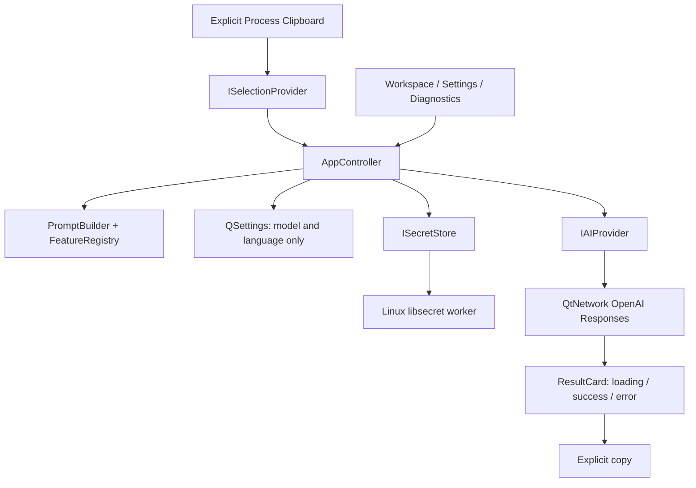

# Architecture

Core uses Qt value types and has no platform API calls. Three feature definitions
and their instructions are centralized. All M0 features exclude profiles.
Input is limited to 100,000 UTF-16 code units.

AppController snapshots clipboard text only on explicit capture, then builds a
request on a feature click. It ignores overlapping actions and late key-read
completion after cancellation. Clipboard changes during a request have no effect.

ISelectionProvider currently has a manual clipboard implementation; an empty
capture clears the previous selection. This is intentionally different from
simulated Ctrl+C, where clipboard sequence tracking will be required in M3/M5.

IAIProvider exposes generate, cancel, busy and completion. OpenAIProvider uses
QNetworkAccessManager, an absolute 30-second timer, response-size bounds and
sanitized error mapping. Model is supplied by settings. JSON output messages are
iterated rather than assuming output[0] is assistant text. No tools are enabled.

ISecretStore exposes asynchronous read/save/remove. LinuxSecretStore performs
libsecret calls on Qt's worker pool, never the GUI thread. The native Secret
Service performs encryption and unlock prompting. QSettings is not a fallback.
The keyring can wait for desktop unlock; the AI action can be cancelled while
this happens. No secret-store cancellation/timeout API is currently provided.

Application connects the shared controller to Qt Widgets and QSystemTrayIcon.
Qt parent ownership handles child widgets. Top-level windows are value members
with explicit lifetime; the platform factory returns a unique_ptr.

Platform-specific source files are selected by CMake. On Windows only shared
library/test targets are defined; Windows builds are NOT TESTED. No large Windows
placeholder backend exists.
Native integrations and additional interfaces are added only when their milestone
needs them.

Reference material:
- [Qt 6 networking](https://doc.qt.io/qt-6/qnetworkaccessmanager.html)
- [libsecret password storage](https://gnome.pages.gitlab.gnome.org/libsecret/)
- [OpenAI Responses](https://developers.openai.com/api/reference/cli/resources/responses/methods/create)

The reference macOS project's README informed product behavior only.

## M1 extension (M0 accepted)

The M0 description above records the preserved baseline. M1 adds an independent
AT-SPI monitor feeding local Diagnostics, without replacing the clipboard provider.
See [M1 architecture](m1-architecture.md) for the worker/GLib event loop strategy,
RAII ownership, bounded extraction, debounce and explicit preview lifecycle.
