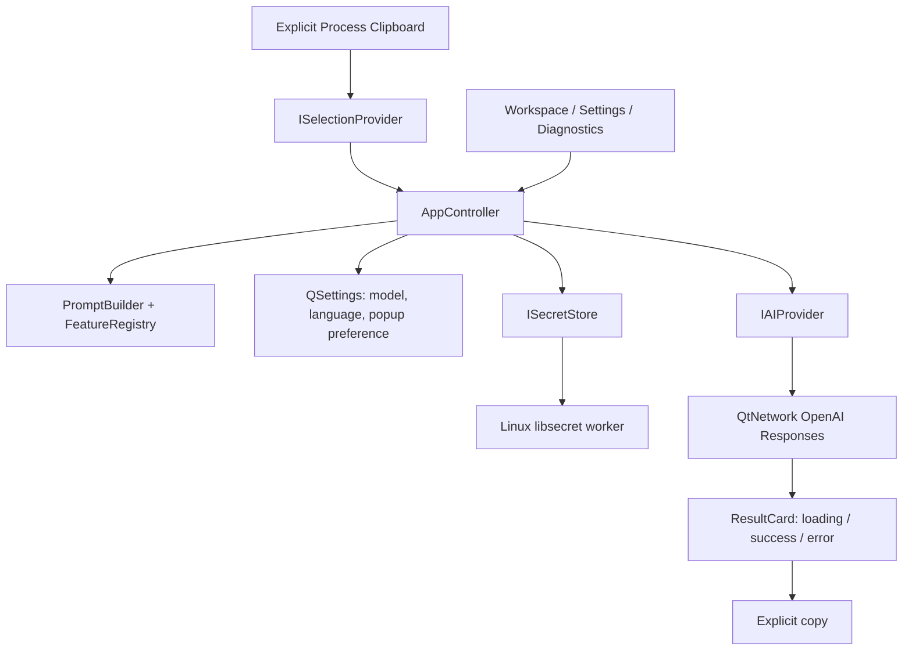
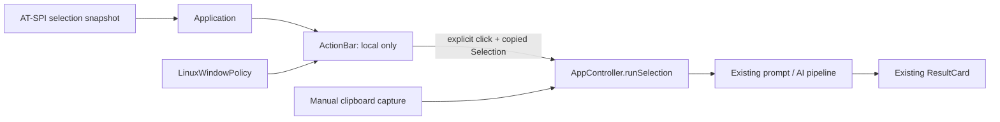

# Architecture

```mermaid
flowchart TD
  Clipboard[Explicit Process Clipboard] --> Selection[ISelectionProvider]
  Selection --> Controller[AppController]
  Workspace[Workspace / Settings / Diagnostics] --> Controller
  Controller --> Prompts[PromptBuilder + FeatureRegistry]
  Controller --> Settings[QSettings: model, language, popup preference]
  Controller --> Secrets[ISecretStore]
  Secrets --> Linux[Linux libsecret worker]
  Controller --> AI[IAIProvider]
  AI --> OpenAI[QtNetwork OpenAI Responses]
  OpenAI --> Result[ResultCard: loading / success / error]
  Result --> Copy[Explicit copy]
```

Core uses Qt value types and has no platform API calls. Three feature definitions
and their instructions are centralized. All M0 features exclude profiles.
Input is limited to 100,000 UTF-16 code units.

AppController snapshots clipboard text only on explicit capture, then builds a
request on a feature click. It ignores overlapping actions and late key-read
completion after cancellation. Clipboard changes during a request have no effect.

ISelectionProvider currently has a manual clipboard implementation; an empty
capture clears the previous selection. This is intentionally different from
simulated Ctrl+C, where clipboard sequence tracking will be required in M3/M5.

IAIProvider exposes generate, cancel, busy and completion. OpenAIProvider uses
QNetworkAccessManager, an absolute 30-second timer, response-size bounds and
sanitized error mapping. Model is supplied by settings. JSON output messages are
iterated rather than assuming output[0] is assistant text. No tools are enabled.

ISecretStore exposes asynchronous read/save/remove. LinuxSecretStore performs
libsecret calls on Qt's worker pool, never the GUI thread. The native Secret
Service performs encryption and unlock prompting. QSettings is not a fallback.
The keyring can wait for desktop unlock; the AI action can be cancelled while
this happens. No secret-store cancellation/timeout API is currently provided.

Application connects the shared controller to Qt Widgets and QSystemTrayIcon.
Qt parent ownership handles child widgets. Top-level windows are value members
with explicit lifetime; the platform factory returns a unique_ptr.

Platform-specific source files are selected by CMake. On Windows only shared
library/test targets are defined; Windows builds are NOT TESTED. No large Windows
placeholder backend exists.
Native integrations and additional interfaces are added only when their milestone
needs them.

Reference material:
- [Qt 6 networking](https://doc.qt.io/qt-6/qnetworkaccessmanager.html)
- [libsecret password storage](https://gnome.pages.gitlab.gnome.org/libsecret/)
- [OpenAI Responses](https://developers.openai.com/api/reference/cli/resources/responses/methods/create)

The reference macOS project's README informed product behavior only.

## M1 extension (M0 accepted)

The M0 description above records the preserved baseline. M1 adds an independent
AT-SPI monitor feeding local Diagnostics, without replacing the clipboard provider.
See [M1 architecture](m1-architecture.md) for the worker/GLib event loop strategy,
RAII ownership, bounded extraction, debounce and explicit preview lifecycle.

## M2 selection ActionBar

Application connects the M1 monitor to one value-member ActionBar. ActionBar
contains only FeatureRegistry buttons and an optional Selection value. Its click
handler copies that value, hides/clears the bar, then emits featureChosen.
Application calls AppController::runSelection, which reuses runText. Neither the
bar nor the controller queries AT-SPI or clipboard during this action.

```mermaid
flowchart LR
  Monitor[AT-SPI selection snapshot] --> App[Application]
  App --> Bar[ActionBar: local only]
  Policy[LinuxWindowPolicy] --> Bar
  Bar -->|explicit click + copied Selection| Controller[AppController.runSelection]
  Clipboard[Manual clipboard capture] --> Controller
  Controller --> AI[Existing prompt / AI pipeline]
  AI --> Result[Existing ResultCard]
```

IPlatformWindowPolicy separates window capability/configuration/placement from
AI and text semantics. LinuxWindowPolicy detects QGuiApplication::platformName:
xcb is AnchoredNonActivating (including a Qt xcb process on a Wayland desktop);
native wayland* and other backends are Unsupported. No unanchored experimental
mode or compositor-specific integration is added.

The Qt flags are Tool, FramelessWindowHint, WindowStaysOnTopHint and
WindowDoesNotAcceptFocus; WA_ShowWithoutActivating and NoFocus buttons accompany
them. Automatic display does not activate, raise, requestActivate or setFocus.
The integration test measures X11 system focus; real GNOME behavior is separate.

ActionBarPlacement is pure geometry: horizontal center above selection with an
8px gap, below if above would cross the screen top, then clamp to availableGeometry.
The policy chooses screenAt(anchor center), then primaryScreen. It preserves raw
AT-SPI coordinates and does not invent scaling conversion. If the bar cannot fit
the screen, placement fails and no toolbar shows. Diagnostics labels placement
as requested Qt geometry, not proof of actual compositor positioning.

QSettings gains only ui/automaticPopup (default false). Settings and tray update
it immediately, independently of model/key settings. Disabling hides the bar but
does not stop the monitor; enabling waits for a new selection. Clear/expiry,
monitor stop/unavailable, dismiss, loading and unsupported/missing placement hide
and clear the toolbar snapshot. Busy controller actions cannot overlap. No second
expiry/history mechanism exists. Last anchor/placement metadata retains no text.

Qt references: [window flags and attributes](https://doc.qt.io/qt-6/qt.html#WindowType-enum)
and [screenAt](https://doc.qt.io/qt-6/qguiapplication.html#screenAt).
See [M2 completion](m2-completion.md) and [overlay matrix](m2-overlay-compatibility.md).

## M3 manual fallback and shortcuts

All explicit entrypoints (shortcut, tray Open Selection Actions, external --trigger)
call Application::triggerManualActions. Resolution occurs before activating the
normal ManualActionPalette. SelectionResolver invokes lazy source callbacks in
order: live M1 cache, supported xcb PRIMARY, Clipboard. Empty/whitespace and over
100,000 UTF-16 units are rejected. LinuxSelectionResolver gates PRIMARY on both
xcb and QClipboard::supportsSelection. It never writes PRIMARY or monitors changes.

ManualActionPalette owns a ResolvedSelection value and labels its source. The
first 1,000 characters are shown locally; the complete snapshot is sent only after
a FeatureRegistry button click, via existing AppController::runSelection.
Repeated triggers replace the snapshot, empty triggers clear it, closing/hiding
clears text, and a busy AI request produces an informational palette with no
executable selection. M0/M1/M2 implementations remain parallel entrypoints.

IGlobalShortcut exposes start(explicitEnable), stop, status and activated.
The platform factory chooses by Qt backend: xcb → X11, wayland* → portal, otherwise
unavailable. The fixed display label and action ID are centralized in its header.
X11 uses one worker, dedicated X display, passive Ctrl+Alt+P grabs and Caps/Num
modifier variants. It waits in blocking poll on the X fd and a shutdown pipe, not
on the GUI thread. Scoped X error trapping detects collision; cleanup releases
all grabs on its own connection. No general key event subscription is installed.

PortalGlobalShortcut is a state machine over PortalTransport. QtPortalTransport
uses asynchronous Qt DBus messages for version probe, CreateSession and BindShortcuts,
and subscribes to tokenized Response paths before calling methods. It supports v1
operations, checks exact session/action IDs and shows the returned trigger description.
Cancellation/error closes request/session; generation counters ignore stale replies.
Session closure, service-owner change and bus disconnect disable registration.
A bounded pending-request timer covers an abandoned configuration dialog.
Version probe may occur on enabled startup, but binding requires explicit enable/retry.
No v2-only ConfigureShortcuts dependency is introduced.

InstanceCoordinator uses a private user runtime subdirectory, a primary-lifetime
QLockFile and a filesystem QLocalServer with UserAccessOption. Linux additionally
checks SO_PEERCRED uid. Only exact trigger/open newline frames are accepted; frames
are bounded, idle clients time out and concurrent connections are capped. IPC
contains commands only, no text or credentials. Forwarding requires an acknowledgement.
Only the lifetime-lock owner can remove a confirmed unreachable stale endpoint.
A starting/unresponsive live primary causes a clear failure/retry, never a second
tray process or removal of its socket. CLI startup waits are bounded; resident
operation is signal-driven. Normal second launch opens the existing workspace.

References:
[GlobalShortcuts v1-compatible API](https://flatpak.github.io/xdg-desktop-portal/docs/doc-org.freedesktop.portal.GlobalShortcuts.html),
[request response lifecycle](https://flatpak.github.io/xdg-desktop-portal/docs/doc-org.freedesktop.portal.Request.html),
[shortcut syntax](https://specifications.freedesktop.org/shortcuts/latest/),
[local socket access options](https://doc.qt.io/qt-6/qlocalserver.html#SocketOption-enum).
