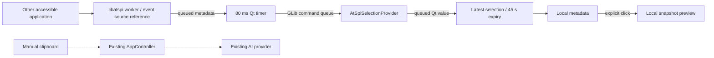

# M1 AT-SPI integration

The accepted M0 path is unchanged. Application receives an optional ISelectionMonitor
from PlatformFactory. No monitor is attached to AppController or IAIProvider.

## Event loops and threads

Ubuntu 22.04 libatspi 2.44 attaches its D-Bus watches to GLib's default context.
Simply using a QThread with a different Qt/GLib context does not move those watches.
preparePlatformEventLoop sets QT_NO_GLIB=1 before QApplication; the GUI then uses
Qt's Unix dispatcher. One dedicated native thread owns the default GLib context.
This is process-local, not a desktop or system configuration change.

Native initialization, listener registration, event delivery, all text/geometry
calls, GObject refs and cleanup run on that worker. The callback retains one
source and posts only a sequence number to the GUI. It does no text extraction.

A single-shot 80 ms Qt timer requests extraction through a GAsyncQueue/custom
GLib source. The queue wakes the event loop; there is no periodic polling.
Results and status are delivered via explicit queued Qt connections. Sequence
numbers reject superseded results. Exact duplicate normalized selections do not
emit repeated selectionDetected signals.

The worker persists across Stop/Start. Stop deregisters the listener and drops
the native candidate; it does not repeatedly destroy libatspi global state.
Only destruction requests shutdown, waits for native cleanup and calls atspi_exit.
Initialization failure is reported and the worker remains controllable; after
fixing a missing bus, restart the app to initialize a new session.
Shutdown may wait for a currently executing D-Bus call; routine start/stop and
extraction never wait on the GUI thread.

## Extraction and ownership

AtSpiSelectionProvider operates on a small IAtSpiTextSource view of exactly one
event source. It does not traverse desktop or focused-app trees. NativeTextSource
owns the Text interface reference; the worker owns the accessible reference.
GError, gchar, range/rect and listener allocations have RAII cleanup. Incoming
AtspiEvent objects are freed with their boxed-type deleter.

Read the first valid nonempty range, preserving whitespace. Reject ranges over
100,000 characters before fetching text; also bound returned UTF-8 conversion
and final UTF-16 size. At most 32 ranges and a soft two-second traversal budget
are used to limit malformed sources. Individual libatspi calls use 250 ms timeout
and 1 s application-startup allowance. A slow final call can exceed the soft budget.
No unbounded concatenation of multi-selections is implemented.

The application name comes from the containing application, not a window title.
Screen rectangles remain in AT-SPI coordinates, with no Qt coordinate conversion.
Missing/invalid/extreme geometry never invalidates otherwise valid text.
Password controls and this process's own accessibility sources are excluded.

## Privacy and cache lifetime

At most the current native candidate and latest normalized selection are retained.
Selected text is never written to a log, file, IPC stream, clipboard or AI request.
Preview is a deliberate local snapshot, cleared on a new selection, clear/stop,
expiry, or hiding Diagnostics. No passive text preview is rendered.

Libatspi maintains its own accessible-proxy cache; the app does not maintain a
selection history. Library internal metadata subscriptions are not application
key/text-change listeners. The sole application listener is
object:text-selection-changed.

## Evidence and limits

See m1-completion.md and the compatibility matrix for measured results. Headless
synthetic integration verifies actual D-Bus event delivery and text retrieval; it
does not establish GNOME/XWayland/Wayland app compatibility or M2 positioning.
Memory ownership has been reviewed and repeated selection is exercised; no
Valgrind/ASan or long-duration RSS profiling result is claimed.

Reference: [libatspi 2.44 event-loop implementation](https://github.com/GNOME/at-spi2-core/blob/AT_SPI2_CORE_2_44_0/atspi/atspi-misc.c).
